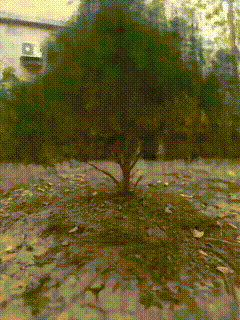

# A Study of NeRF 
## About This Repository
This repository is a clone of the original Original Repo [nerf-pytorch](https://github.com/yenchenlin/nerf-pytorch) created by [yenchenlin
](https://github.com/yenchenlin) . It has been duplicated to experiment with the original project.


## Installation

```
git clone https://github.com/yenchenlin/nerf-pytorch.git
cd nerf-pytorch
pip install -r requirements.txt
```

<details>
  <summary> Dependencies (click to expand) </summary>
  
  ## Dependencies
  - PyTorch 1.4
  - matplotlib
  - numpy
  - imageio
  - imageio-ffmpeg
  - configargparse
  
The LLFF data loader requires ImageMagick.

You will also need the [LLFF code](http://github.com/fyusion/llff) (and COLMAP) set up to compute poses if you want to run on your own real data.
  
</details>

## How To Run?

### Quick Start

Download data for two example datasets: `lego` and `fern`
```
bash download_example_data.sh
```

To train a low-res `lego` NeRF:
```
python run_nerf.py --config configs/lego.txt
```
After training for 100k iterations (~4 hours on a single 2080 Ti), you can find the following video at `logs/lego_test/lego_test_spiral_100000_rgb.mp4`.


---

To train a low-res `fern` NeRF:
```
python run_nerf.py --config configs/fern.txt
```
After training for 200k iterations (~8 hours on a single 2080 Ti), you can find the following video at `logs/fern_test/fern_test_spiral_200000_rgb.mp4` and `logs/fern_test/fern_test_spiral_200000_disp.mp4`


---

### How To Reproduce Our Experiments 
To reproduce the results from our experiments simply run:

```
./run.sh
```

### How To Run On Our Created Dataset
First download our created dataset [here](https://drive.google.com/file/d/1E16XFtkoqFy7EzhlDq3pVp3D0J40OU0E/view?usp=drive_link).
And place the dataset in the data folder. 
If you’re interested in learning how to create your own datasets.
Please refer to the original [NeRF documentation](https://github.com/bmild/nerf?tab=readme-ov-file#generating-poses-for-your-own-scenes).  

#### Shoe Dataset  
To train the model on the shoe dataset, use the following command:  
```
python run_nerf.py --config configs/shoe.txt  
```  
After training for 200,000 iterations (~12 hours on a single 2080 Ti), you can see the results:  


#### Tree Dataset  
To train the model on the tree dataset, use the following command:  
```
python run_nerf.py --config configs/tree.txt  
```  
After training for 200,000 iterations (~9 hours on a single 2080 Ti), you can see the results:  



## Method

[NeRF: Representing Scenes as Neural Radiance Fields for View Synthesis](http://tancik.com/nerf)  
 [Ben Mildenhall](https://people.eecs.berkeley.edu/~bmild/)\*<sup>1</sup>,
 [Pratul P. Srinivasan](https://people.eecs.berkeley.edu/~pratul/)\*<sup>1</sup>,
 [Matthew Tancik](http://tancik.com/)\*<sup>1</sup>,
 [Jonathan T. Barron](http://jonbarron.info/)<sup>2</sup>,
 [Ravi Ramamoorthi](http://cseweb.ucsd.edu/~ravir/)<sup>3</sup>,
 [Ren Ng](https://www2.eecs.berkeley.edu/Faculty/Homepages/yirenng.html)<sup>1</sup> <br>
 <sup>1</sup>UC Berkeley, <sup>2</sup>Google Research, <sup>3</sup>UC San Diego  
  \*denotes equal contribution  
  


> A neural radiance field is a simple fully connected network (weights are ~5MB) trained to reproduce input views of a single scene using a rendering loss. The network directly maps from spatial location and viewing direction (5D input) to color and opacity (4D output), acting as the "volume" so we can use volume rendering to differentiably render new views


## Citation
**Note this is a clone from another repo. Thus if you find this repo to be interesting. Please cite the original authors :)** 

Kudos to the authors for their amazing results:
```
@misc{mildenhall2020nerf,
    title={NeRF: Representing Scenes as Neural Radiance Fields for View Synthesis},
    author={Ben Mildenhall and Pratul P. Srinivasan and Matthew Tancik and Jonathan T. Barron and Ravi Ramamoorthi and Ren Ng},
    year={2020},
    eprint={2003.08934},
    archivePrefix={arXiv},
    primaryClass={cs.CV}
}
```

Kudos to the author of nerf-pytorch.
```
@misc{lin2020nerfpytorch,
  title={NeRF-pytorch},
  author={Yen-Chen, Lin},
  publisher = {GitHub},
  journal = {GitHub repository},
  howpublished={\url{https://github.com/yenchenlin/nerf-pytorch/}},
  year={2020}
}
```
